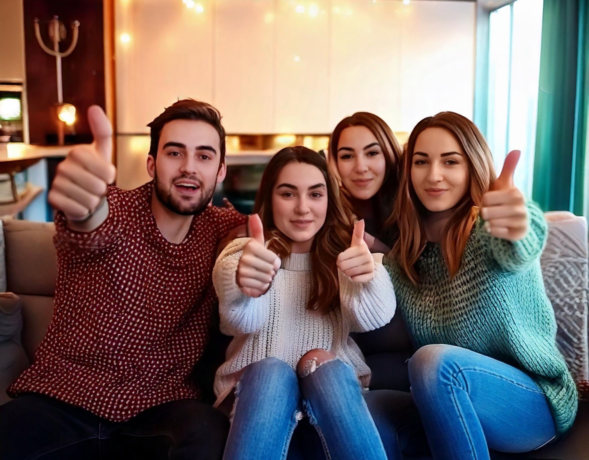

```{r, echo = FALSE, message=FALSE, warning=FALSE}
library(tidyverse)
library(caret)
library(ranger)
library(tree)
library(glmnet)
library(ISLR)
library(Matrix)
library(ggplot2)
```

# The Problem
## Background
::: columns
::: {.column width="50%"}
<br><br><br><br><br>

- 1 in 3 older adult dies with Alzheimer's*
- Exact cause is not fully understood
- Early detection is critical
:::

::: {.column width="50%"}

:::
:::

::: footer
*According to Alzheimer's Association, 2024
:::

## Goal
<br><br><br><br><br><br><br><br>

### To create a [right sized]{.red} model with [adequate performance]{.red} that correctly predicts if the patient has [Alzheimer's]{.red} or [not]{.red}.

## Dataset Description

::: columns
::: {.column width="37%"}
- Patient Information
  - Demographic Details
  - Lifestyle Factors
- Medical History
- Clinical Measurements
- Cognitive & Functional Assessments
- Symptoms
- [Diagnosis Information <br>(Alzheimer's or No Alzheimers)]{.red}
<br><br><br><br><br>

**2139** Observations <br>
**33** Features
:::
::: {.column width="3%"}
:::


::: {.column width="60%"}
```{r, data_description, fold: true, echo=FALSE, message=FALSE}

# Load required libraries
library(readr)   # To read CSV files
library(knitr)   # To format tables in a nice layout
library(kableExtra)

# Read the CSV file into a dataframe
data <- read_csv("dataset_description_Full.csv", show_col_types = FALSE)

kable(data, format = "html") %>%
  kable_styling() %>%
  column_spec(1:ncol(data), extra_css = "font-size: 9px;") %>%  # Font size for table body
  row_spec(0, extra_css = "font-size: 9px;")  # Font size for headers (row 0)
```
:::
:::

# Key Finding
## The Best Solution
<br><br><br><br><br>

**[Random Forest]{.red}** emerged as the best model with the highest Sensitivity

- **Sensitivity** score is important - indicates the performance in correctly classifying positive cases. 
- **90%** of the patients with Alzheimer's are correctly identified by our model.
- Few key things to look for in a patient are - **Functional Assessment score**, **ADL** and **MMSE**


# Our Approach
## Four Models Tested

::: columns

::: {.column width="33%"}
<br>
Imagine if you are trying to decide if you'll like a new movie.
:::

::: {.column width="3%"}
:::

::: {.column width="32%"}
#### 1. Lasso


#### 2. $k$NN

:::

::: {.column width="32%"}
#### 3. LDA


#### 4. Random Forest

:::
:::


## Single Tree
```{r readsplitdata, message=FALSE, echo = FALSE}

set.seed(5003)

alzdata <- readRDS("alzdata.rds")
#alzdata <- alzdata[ , c("DietQuality", "Hypertension", "CholesterolLDL", "MMSE", "FunctionalAssessment", "MemoryComplaints", "BehavioralProblems", "ADL", "Diagnosis")]
indices <- createDataPartition(alzdata$Diagnosis, p = 0.7, list = FALSE)
train_dat <- alzdata[indices,]
test_dat <- alzdata[-indices, ]
```

``` {r newtree, echo=FALSE}
library(rpart)
library(rpart.plot)

# Use rpart for the model as it integrates well with rpart.plot
treemap <- rpart(Diagnosis ~ ., data = train_dat)
treemap$frame$yval <- ifelse(treemap$frame$yval == "Alzheimers", "Yes", "No")

# Use rpart.plot for a visually enhanced plot
rpart.plot(treemap,
           type = 3,           # Box style
           extra = 0,        # Shows percentage of observations in each class
           under = TRUE,       # Show the split label under the box
           faclen = 1,         # Full names for factor levels
           digits = 2,
           fallen.leaves = TRUE, # Arrange the boxes in a more compact way
           cex = 0.7,          # Text size
           box.palette = "white", # Color palette for the boxes
           #shadow.col = "gray" # Adds shadow to boxes
)
```

``` {r stcm, echo=FALSE, message=FALSE, warning=FALSE}
predictiontree <- predict(treemap, newdata = test_dat)
predicted_labels <- ifelse(predictiontree[, "Alzheimers"] > 0.35, "Alzheimers", "No_Alzheimers")
confusion_matrix_singletree <- confusionMatrix(as.factor(predicted_labels), as.factor(test_dat$Diagnosis), positive = "Alzheimers")
Sensit1 <- confusion_matrix_singletree$byClass[["Sensitivity"]]
Specif1 <- confusion_matrix_singletree$byClass[["Specificity"]]
Accura1 <- confusion_matrix_singletree$overall[["Accuracy"]]
TP1 <- confusion_matrix_singletree$table["Alzheimers", "Alzheimers"]
FP1 <- confusion_matrix_singletree$table["Alzheimers", "No_Alzheimers"]
FN1 <- confusion_matrix_singletree$table["No_Alzheimers", "Alzheimers"]
precision1 <- TP1 / (TP1 + FP1)
recall1 <- TP1 / (TP1 + FN1)
F1_1 <- 2 * (precision1 * recall1) / (precision1 + recall1)
```
**Sensitivity:** `r round(Sensit1, 4)`   |   **Specificity:** `r round(Specif1, 4)` |  **Accuracy:** `r round(Accura1, 4)` | **F1:** `r round(F1_1, 4)`


## Random Forest
```{r rfB, message=FALSE, echo=FALSE, warning=FALSE}
ntree_seq <- c(1, 50, 100, 400, 500, 700, 800, 900, 1000, 2000)
max.ntree_seq <- max(ntree_seq)
test_diagnosis <- test_dat[["Diagnosis"]]
ranger_model <- ranger(Diagnosis ~ ., data = train_dat, num.trees = max.ntree_seq, probability = TRUE)
rand.forest.function <- function(x) { 
  predict_ranger <- predict(ranger_model, data = test_dat, num.trees = x)[["predictions"]]
  predicted_labels <- ifelse(predict_ranger[, "Alzheimers"] > 0.35, "Alzheimers", "No_Alzheimers") |> as.factor()
  CM <- confusionMatrix(test_diagnosis, predicted_labels, positive = "Alzheimers")
  Sensit <- CM$byClass[["Sensitivity"]]
  Specif <- CM$byClass[["Specificity"]]
  Accura <- CM$overall[["Accuracy"]]
  TP <- CM$table["Alzheimers", "Alzheimers"]
  FP <- CM$table["Alzheimers", "No_Alzheimers"]
  FN <- CM$table["No_Alzheimers", "Alzheimers"]
  precision <- TP / (TP + FP)
  recall <- TP / (TP + FN)
  F1 <- 2 * (precision * recall) / (precision + recall)
  Performance_measures <- list(Sensitivity = Sensit, Specificity = Specif, Accuracy = Accura, F1 = F1)
  }
perf_measures <- map(ntree_seq, rand.forest.function)
sensitivities <- map_dbl(perf_measures, "Sensitivity")
plot_data <- data.frame(ntree_seq, sensitivities)
lineplot <- ggplot(plot_data, aes(x = ntree_seq, y = sensitivities)) +
  geom_line() +
  geom_point() + 
  geom_text(aes(label = round(sensitivities, 4)), 
            vjust = -0.5, 
            color = "black", 
            size = 3.5) +
  labs(x = "Number of Trees", y = "Sensitivity") +
  theme_minimal()


perf_measures_df <- map_dfr(ntree_seq, function(x) {
  perf <- rand.forest.function(x)
  data.frame(ntree_seq = x,
             Sensitivity = perf$Sensitivity,
             Specificity = perf$Specificity,
             Accuracy = perf$Accuracy,
             F1 = perf$F1)
})

# Reshape the data to long format for ggplot2
perf_measures_long <- perf_measures_df %>%
  pivot_longer(cols = c(Sensitivity, Specificity, Accuracy, F1),
               names_to = "Measure",
               values_to = "Value")

# Create the grouped bar plot
ggplot(perf_measures_long, aes(x = factor(ntree_seq), y = Value, fill = Measure)) +
  geom_bar(stat = "identity", position = "dodge") +
  labs(x = "Number of Trees", y = "Value") +
  scale_fill_manual(values = c("#E09F3E", "#335C67", "#99A88C", "#E3DED1")) + 
  theme_minimal()


```


## Comparing Model Performance
#### Model's ability to correctly classify positive cases

``` {r LLR, echo=FALSE}
#Lasso Logistic Regression


```


```{r modelcomparison, echo=FALSE}

# Create the data frame
data <- data.frame(
  Model = c("Lasso", "kNN", "LDA", "100-tree Random Forest"),
  Sensitivity = c(0.7575, 0.8465, 0.8377, 0.8983)
)

# Define colors for each bar
colors <- c("Lasso" = "#E3DED1", "kNN" = "#99A88C", "LDA" = "#335C67", "100-tree Random Forest" = "#E09F3E")

# Create the bar plot
ggplot(data, aes(x = Model, y = Sensitivity, fill = Model)) +
  geom_bar(stat = "identity", width = 0.6, show.legend = FALSE) + # Bars with no legend
  geom_text(aes(label = Sensitivity), vjust = -0.5, size = 4) +   # Display data labels
  scale_fill_manual(values = colors) +                            # Custom colors
  labs(x = NULL, y = "Sensitivity") +                                       # Y-axis label
  theme_minimal() +                                               # Minimal theme for a clean look
  theme(
    axis.text = element_text(size = 10),                          # Adjust text size
    axis.title = element_text(size = 12)                          # Adjust axis title size
  )

```
## Goals Acheived


::: columns
::: {.column width="33%"}
<br><br><br><br>

<br>

### 1
#### Found a right-size model with adequate performance
:::

::: {.column width="33%"}
<br><br><br><br>

<br>

### 2
#### Created a foundational model for early detection
:::

::: {.column width="33%"}
<br><br><br><br>

<br>

### 3
#### Identified key features that are associated with Alzheimer's
:::
:::


## Challenges
::: columns
::: {.column width="45%"}
<br><br><br><br><br><br><br>

- **Class imbalance** in our dataset - addressed through probability
- **Limited observation**
- **Synthetic data**
:::

::: {.column width="5%"}
::: 

::: {.column width="50%"}
<br><br><br>

:::
:::
# Pathway for deployment

## Next steps

::: columns
::: {.column width="45%"}
<br><br><br><br><br>

- Acquire **real world data** to test the model performance further 
- Bring a **qualified clinical expert** in the loop for validation
- Investigate **additional features** associated with Alzheimer's 
:::

::: {.column width="5%"}
::: 

::: {.column width="50%"}
<br><br><br><br>

:::
:::

# Q&A